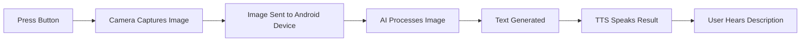

# Welcome to FeelVision

FeelVision is smart glasses system designed to empower visually impaired individuals by providing real-time environmental awareness through AI-powered assistance. 

Our attachable hardware module works with your Android device to describe the world around you, read text, recognize faces, and help you navigate safely.

## Hardware Design:

## Quick Start

    

        

            <i class="fas fa-download"></i>
        

        <h3>1. Install App</h3>
        
Download the FeelVision Android app from the Play Store or build from source.

        <a href="user-guide/app-installation/" class="card-link">Install Guide →</a>
    

    

        

            <i class="fas fa-microchip"></i>
        

        <h3>2. Connect Hardware</h3>
        
Attach the Luckfox Pico module to your glasses and connect via USB.

        <a href="user-guide/hardware-setup/" class="card-link">Setup Guide →</a>
    

    

        

            <i class="fas fa-rocket"></i>
        

        <h3>3. Start Using</h3>
        
Press the capture button to hear descriptions of your surroundings.

        <a href="user-guide/getting-started/" class="card-link">Get Started →</a>
    

## Key Features

### 🎯 Seven Specialized Modes

FeelVision offers seven different modes optimized for specific tasks:

- **Default Mode**: General scene description
- **OCR Mode**: Read text from signs, documents, and labels
- **Navigate Mode**: Obstacle detection and navigation assistance
- **Face Mode**: Recognize known people and identify strangers
- **Currency Mode**: Identify currency notes
- **Educational Mode**: Learn about objects and read educational content
- **Narrate Mode**: Detailed scene narration

### 🌍 Multi-Language Support

Native support for:
- English
- Hindi (हिंदी)
- Telugu (తెలుగు)
- Tamil (தமிழ்)
- Kannada (ಕನ್ನಡ)
- Malayalam (മലയാളം)

### 🧠 AI-Powered

- Real-time AI inference using Google Gemma model
- Streaming responses for immediate feedback
- Face recognition with MediaPipe and MobileFaceNet
- Offline capability - no constant internet needed

### ♿ Accessibility First

- Audio-first interaction design
- Physical buttons for tactile feedback
- Simple, intuitive controls
- Minimal learning curve

## System Requirements

### Hardware
- Android device running Android 7.0 (API 24) or higher
- Luckfox Pico hardware module
- USB cable for device connection
- Pair of glasses (any standard frame)

### Software
- FeelVision Android app
- 2GB+ RAM recommended
- 500MB free storage for AI models
- Camera permission
- USB device permission

## How It Works

## What Users Say

> "FeelVision has given me independence I never thought possible. I can now navigate unfamiliar places with confidence and recognize friends without asking for help."

> "The face recognition feature is incredible. I can finally know who's in the room without feeling awkward. The currency detection has made shopping so much easier."

> "The multi-language support is amazing. I can use it in my native language, which makes it feel much more natural and comfortable."

## Get Started Today

Ready to experience FeelVision? Follow our comprehensive guides to set up your device and start exploring the world with new confidence.

    <a href="/getting-started/" class="btn btn-primary">
        <i class="fas fa-rocket"></i>
        Get Started
    </a>
    <a href="/modes/" class="btn btn-secondary">
        <i class="fas fa-th-large"></i>
        Explore Modes
    </a>

---

## Need Help?

- Check our [Troubleshooting](/troubleshooting/) guide for common issues
- Visit our [FAQ](/faq/) for frequently asked questions
- Contact support- Email: support@feelvision.org
- GitHub Issues: [github.com/feelvision/feelvision/issues](https://github.com/feelvision/feelvision/issues)
