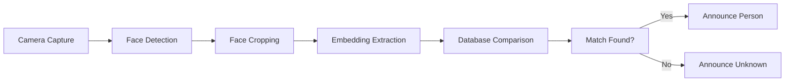

# Face Recognition Guide

Face recognition allows FeelVision to identify known people and announce them by name and relationship. This guide covers enrolling faces, managing profiles, and optimizing recognition accuracy.

## How Face Recognition Works



### Technical Overview

FeelVision uses a two-stage face recognition system:

1. **Face Detection**: MediaPipe Blaze Face detects faces in images
2. **Face Recognition**: MobileFaceNet extracts 192-dimensional embeddings for matching

### Accuracy Threshold

- **Match Threshold**: L2 distance < 0.95
- **Confidence Score**: Calculated from cosine similarity
- **Cooldown Period**: 15 seconds between announcements

## Enrolling Faces

### Step-by-Step Enrollment

1. **Open Face Management**
   - Launch FeelVision app
   - Go to "People" section
   - Tap "Add Person"

2. **Enter Person Details**
   - **Name**: Enter the person's name
   - **Relation**: Specify relationship (e.g., brother, colleague, friend)
   - **Notes**: Add optional notes (e.g., "wears glasses")

3. **Capture Photos**
   - Position the person in good lighting
   - Capture 3-5 photos from different angles:
     - Front view
     - Slight left turn
     - Slight right turn
     - With and without glasses (if applicable)
     - Different expressions (neutral, smiling)

4. **Save Profile**
   - Review captured photos
   - Tap "Save"
   - The app will process embeddings in the background

### Best Practices for Enrollment

#### Lighting

- Use even, frontal lighting
- Avoid harsh shadows
- Natural daylight is ideal
- Avoid backlighting (person in front of bright window)

#### Distance

- Stand 1-2 meters from the person
- Ensure face fills at least 30% of frame
- Too close: Features may be distorted
- Too far: Details may be lost

#### Angles

- Capture from multiple angles
- Include profile views (side)
- Capture with different head tilts
- This improves recognition in various positions

#### Expression

- Include neutral expression
- Add smiling photos
- Different expressions help recognition
- Avoid extreme expressions

#### Appearance

- Capture with typical appearance
- Include photos with/without glasses
- Capture with different hairstyles if variable
- Update photos if appearance changes significantly

## Managing Profiles

### Viewing All Profiles

1. Go to "People" section
2. See list of all enrolled people
3. Each profile shows:
   - Name and relation
   - Number of photos
   - Last recognition time

### Editing a Profile

1. Tap on a person's profile
2. You can:
   - Edit name or relation
   - Add more photos
   - Delete photos
   - Delete entire profile

### Adding More Photos

1. Open the person's profile
2. Tap "Add Photo"
3. Capture additional photos
4. Save to update embeddings

### Deleting a Profile

1. Open the person's profile
2. Tap "Delete Profile"
3. Confirm deletion
4. All photos and embeddings are removed

### Bulk Operations

- **Export All**: Export all profiles to backup
- **Import All**: Restore from backup
- **Clear All**: Remove all profiles (use with caution)

## Recognition in Action

### Using Face Mode

1. Switch to Face mode (press Button A until you hear "Face mode")
2. Look at people around you
3. The app automatically:
   - Detects faces
   - Extracts embeddings
   - Compares with database
   - Announces recognized people

### What You'll Hear

#### Recognized Person

> "John, your brother."

> "Sarah, your colleague."

> "Michael, your friend."

#### Unknown Person

> "Unknown person."

> "Two unknown people."

#### Multiple People

> "John, your brother, and one unknown person."

> "Sarah, your colleague, and Michael, your friend."

### Recognition Behavior

- **Continuous Monitoring**: Scans continuously in Face mode
- **Smart Cooldown**: Won't repeat same person within 15 seconds
- **Multi-Person**: Can detect and announce multiple people
- **Priority**: Recognized people announced before unknown

## Optimizing Recognition

### Improving Accuracy

#### Add More Photos

- More photos = better accuracy
- Aim for 5-7 photos per person
- Include variety in angles and expressions
- Update photos regularly

#### Update Regularly

- People's appearance changes over time
- Update photos every few months
- Add photos after significant changes (haircut, glasses)
- Remove outdated photos

#### Quality Over Quantity

- Better to have fewer good photos than many poor ones
- Ensure photos are clear and in focus
- Good lighting is essential
- Avoid blurry or dark photos

### Common Issues and Solutions

| Issue | Solution |
|-------|----------|
| Not recognizing someone | Add more photos from different angles |
| False positives | Add more photos to improve distinction |
| Slow recognition | Reduce number of enrolled profiles |
| Not detecting faces | Check lighting and camera positioning |

## Advanced Features

### Similarity Scores

The app logs detailed similarity scores for debugging:

```
Person: John (brother)
  └─ Average Profile Embedding Similarity: L2_Dist = 0.2345 | Cos_Sim = 97.25%
  └─ Individual Enrolled Photos (5):
      ├── Photo: photo1.jpg | L2_Dist = 0.2100 | Cos_Sim = 97.80%
      ├── Photo: photo2.jpg | L2_Dist = 0.2500 | Cos_Sim = 96.88%
      └─ ...
```

### Embedding Caching

- Photo embeddings are cached for performance
- Cache is automatically managed
- No manual cache clearing needed
- Improves recognition speed

### Background Processing

- Embedding computation happens in background
- Doesn't block the UI
- Progress shown in settings
- Can continue using app during processing

## Privacy and Security

### Data Storage

- Face data stored locally on device
- No cloud sync by default
- Encrypted database storage
- Only accessible within the app

### Sharing Profiles

- Profiles can be exported for backup
- Exported data is encrypted
- Import requires same device or authorized device
- Never share profiles with others

### Deleting Data

- Clear all profiles from settings
- Individual profiles can be deleted
- Photos are permanently deleted
- No recovery after deletion

## Troubleshooting Face Recognition

### Face Not Detected

**Problem**: App doesn't detect faces

**Solutions**:
- Check lighting conditions
- Ensure person is facing camera
- Verify camera is working
- Try closer distance
- Check if face is obscured (mask, hat)

### Recognition Not Working

**Problem**: Faces detected but not recognized

**Solutions**:
- Add more photos to profile
- Update photos if appearance changed
- Check similarity scores in debug mode
- Verify profile has embeddings computed
- Try re-enrolling the person

### False Positives

**Problem**: Wrong person identified

**Solutions**:
- Add more distinguishing photos
- Ensure photos are clear and unique
- Check if people look similar
- Consider using relation to distinguish
- Delete and re-enroll if necessary

### Slow Recognition

**Problem**: Recognition takes too long

**Solutions**:
- Reduce number of enrolled profiles
- Close background apps
- Check device performance
- Enable performance mode in settings
- Restart app if needed

## Tips for Social Situations

### Using Face Mode in Gatherings

- Enroll frequent attendees first
- Add photos when people are relaxed
- Update photos before important events
- Practice recognition in controlled settings first

### Etiquette

- Inform people about the feature
- Respect privacy preferences
- Don't enroll people without permission
- Use appropriately in social contexts

### Best Practices

- Use in conjunction with other social cues
- Don't rely solely on face recognition
- Verify identity when important
- Use as a supplement, not replacement

## Integration with Other Modes

### Combining with Default Mode

- Use Default mode for general scene context
- Switch to Face mode when people are present
- Get both environmental and social information

### Using in Navigation

- Face mode can help in crowded places
- Recognize familiar people in public spaces
- Useful in transportation hubs, malls, etc.

### Educational Context

- Use in classrooms to recognize classmates
- Helpful in educational settings
- Can identify teachers and staff

## Future Enhancements

### Planned Features

- **Emotion Recognition**: Detect facial expressions
- **Age Estimation**: Approximate age detection
- **Few-Shot Learning**: Recognize with fewer photos
- **On-Device Learning**: Improve recognition over time

### Community Features

- **Profile Sharing**: Share between family devices
- **Cloud Backup**: Optional cloud sync
- **Community Models**: Shared recognition models

---

**Next:** [Troubleshooting Guide](/troubleshooting/)
