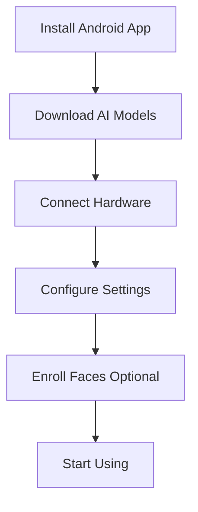

# Getting Started with FeelVision

Welcome to FeelVision! This guide will help you get started with your smart glasses system and begin experiencing the world in a whole new way.

## Before You Begin

Make sure you have the following:

- [ ] Android device running Android 7.0 (API 24) or higher
- [ ] Luckfox Pico hardware module
- [ ] USB cable (Type-C or Micro-USB, depending on your device)
- [ ] Pair of glasses (any standard frame)
- [ ] Stable internet connection (for initial model download)

## Overview of the Setup Process



## Step 1: Install the Android App

### Option A: From Google Play Store

1. Open the Google Play Store on your Android device
2. Search for "FeelVision"
3. Tap "Install"
4. Wait for the installation to complete

### Option B: Build from Source

If you prefer to build the app from source:

1. Clone the repository:
   ```bash
   git clone https://github.com/feelvision/feelvision.git
   cd feelvision/Feelvision-Android
   ```

2. Open the project in Android Studio
3. Build and run the app on your device

## Step 2: Download AI Models

On first launch, the app will prompt you to download the AI models:

1. Launch the FeelVision app
2. Grant the required permissions:
   - Camera permission
   - Storage permission
   - USB device permission
3. The app will automatically download:
   - Gemma AI model (~500MB)
   - Face detection models (~50MB)
   - Face recognition models (~20MB)

**Note:** This download requires a stable internet connection. Once downloaded, the models work offline.

## Step 3: Connect the Hardware

### Attaching the Module

1. **Prepare your glasses**: Ensure your glasses have a suitable frame for attaching the module
2. **Attach the Luckfox Pico**: Use the provided mount to attach the module to your glasses
   - Position the camera lens facing forward
   - Ensure the buttons are accessible
   - Secure the mount firmly

3. **Connect via USB**: Plug the USB cable into:
   - The Luckfox Pico module
   - Your Android device

### Automatic Connection

The app will automatically detect when the Luckfox device is connected:

- You'll hear a confirmation sound
- The status indicator will show "Connected"
- The camera feed will appear in the app (debug mode)

## Step 4: Configure Your Settings

### Language Selection

1. Open the app settings
2. Tap "Language"
3. Select your preferred language:
   - English
   - Hindi (हिंदी)
   - Telugu (తెలుగు)
   - Tamil (தமிழ்)
   - Kannada (ಕನ್ನಡ)
   - Malayalam (മലയാളം)

### Speech Rate

Adjust the speech rate to your preference:
- **Slow**: 0.5x - Good for beginners
- **Normal**: 1.0x - Default setting
- **Fast**: 1.5x - For experienced users

### Other Settings

- **Debug Mode**: Enable for troubleshooting (shows camera feed)
- **Haptic Feedback**: Vibration on button press
- **Auto-start Server**: Automatically start when device connected

## Step 5: Understanding the Buttons

FeelVision uses physical buttons for interaction:

### Button Layout

```
┌─────────────────────────┐
│                         │
│    [Button A]           │  ← Mode Switch
│                         │
│    [Button B]           │  ← Capture/Action
│                         │
│    [Button C]           │  ← (Configurable)
│                         │
└─────────────────────────┘
```

### Button Functions

| Button | Short Press | Long Press (600ms+) |
|--------|-------------|---------------------|
| **A** | Switch to next mode | Switch to previous mode |
| **B** | Capture image / Perform action | Repeat last result |
| **C** | (Configurable) | (Configurable) |

## Step 6: Your First Capture

1. Ensure you're in **Default Mode** (you'll hear "Default mode activated")
2. Point your glasses at an object or scene
3. Press **Button B** (short press)
4. Wait a moment for the AI to process
5. Listen to the description

**Example output:**
> "I see a wooden table with a red coffee mug and a book. There's a window to the right with sunlight coming through."

## Step 7: Exploring Modes

Try different modes by pressing **Button A**:

- **OCR Mode**: Point at text and press Button B to read it
- **Navigate Mode**: Walk around and get navigation guidance
- **Face Mode**: Look at people to identify them
- **Currency Mode**: Hold up a currency note to identify it
- **Educational Mode**: Learn about objects around you
- **Narrate Mode**: Get detailed scene descriptions

## Step 8: Enrolling Faces (Optional)

To use face recognition:

1. Switch to **Face Mode**
2. Open the app and go to "People" section
3. Tap "Add Person"
4. Enter name and relation (e.g., "John", "brother")
5. Take 3-5 photos from different angles
6. Save the profile

Now when you look at that person, FeelVision will announce:
> "John, your brother"

## Tips for Best Performance

### Camera Positioning

- Keep the camera lens clean
- Ensure good lighting when possible
- Hold your head steady during capture
- Point directly at the subject of interest

### Battery Management

- Close the app when not in use
- Reduce screen brightness
- Disable debug mode to save battery
- Use power-saving mode on your phone

### Voice Recognition

- Speak clearly when using voice commands
- Wait for TTS to finish before pressing buttons
- Adjust speech rate if responses are too fast/slow

## Troubleshooting

### Device Not Connecting

- Ensure USB cable is properly connected
- Try a different USB cable
- Restart the app
- Check USB device permissions

### No Audio Output

- Check phone volume
- Ensure TTS is enabled in settings
- Try restarting the app
- Check if another app is using audio

### Slow Response

- Close background apps
- Ensure AI models are downloaded
- Check available storage space
- Restart your phone if needed

## What's Next?

Now that you're set up, explore the full capabilities of FeelVision:

- [Learn about all modes](/pages/modes.html)
- [Set up face recognition](/pages/face-recognition.html)
- [Customize your settings](/pages/hardware-setup.html)
- [Get help with problems](/pages/troubleshooting.html)

## Safety Information

- FeelVision is an assistive device, not a replacement for a guide dog or human assistance
- Always be aware of your surroundings
- Test the device in safe environments first
- Don't rely solely on navigation mode in hazardous areas
- Keep the device charged for extended use

---

**Congratulations!** You're now ready to use FeelVision. Enjoy exploring the world with new confidence and independence!
