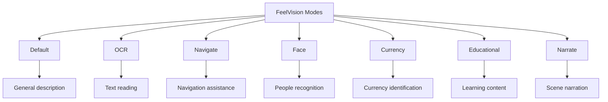

# Modes Guide

FeelVision offers seven specialized modes, each optimized for specific tasks. This guide explains each mode in detail and when to use it.

## Mode Overview



## Switching Modes

### How to Switch

1. **Next Mode**: Press Button A (short press)
2. **Previous Mode**: Press Button A (long press, 600ms+)
3. **Current Mode**: The app announces the mode when switched

### Mode Order

The modes cycle in this order:

```
Default → OCR → Navigate → Face → Currency → Edu → Narrate → Default
```

## Default Mode

### Purpose

General scene description for everyday use.

### When to Use

- Exploring new environments
- Understanding your surroundings
- General curiosity about what's around you
- When unsure which mode to use

### How It Works

1. Point your glasses at a scene
2. Press Button B to capture
3. AI analyzes the image
4. Hear a 3-4 line description

### Example Outputs

> "I see a living room with a beige sofa, wooden coffee table, and a television. There's a window on the left with sunlight coming through. A plant sits in the corner."

> "You're in a park with green grass and tall trees. There's a walking path ahead. A bench is visible to your right."

### Best Practices

- Capture from eye level for best perspective
- Include multiple objects in frame for richer description
- Good lighting improves accuracy
- Avoid overly cluttered scenes

### Tips

- Use this mode first when entering a new space
- Good for getting oriented in unfamiliar places
- Works well in most lighting conditions

---

## OCR (Optical Character Recognition) Mode

### Purpose

Read text from signs, documents, labels, and any printed material.

### When to Use

- Reading street signs
- Checking product labels
- Reading documents or books
- Identifying room numbers or door signs
- Reading menus or price tags

### How It Works

1. Point at text (ensure it's in focus)
2. Press Button B
3. AI extracts and reads the text
4. Text is read exactly as it appears

### Example Outputs

> "Main Street. Turn right for parking."

> "Ingredients: Water, sugar, citrus juice, natural flavors. Best before December 2025."

> "Room 302. Dr. Smith. Cardiology Department."

### Best Practices

- Hold steady for clear text capture
- Ensure good lighting on the text
- Get close enough for text to be readable
- Avoid glare or reflections
- Capture one section of text at a time

### Tips

- Works best with printed text (not handwriting)
- Larger text is easier to read
- Try different angles if text isn't clear
- For long text, capture in sections

### Limitations

- Handwriting may not be recognized
- Very small text may be difficult
- Decorative or stylized fonts may have issues
- Low contrast text may not be readable

---

## Navigate Mode

### Purpose

Real-time navigation assistance and obstacle detection for safe movement.

### When to Use

- Walking in unfamiliar areas
- Navigating indoor spaces
- Crossing streets
- Detecting obstacles in your path
- Getting directional guidance

### How It Works

1. Enable Navigate mode
2. Walk normally
3. The app captures sequential images
4. AI detects motion and obstacles
5. Receive real-time guidance

### Example Outputs

> "Path clear, continue ahead."

> "Stop. Vehicle approaching from left."

> "Step right. Low branch ahead."

> "Caution. Uneven surface ahead."

> "Road crossing ahead. Traffic clear, proceed."

### Urgency Tiers

The mode uses three urgency levels:

| Urgency | Example | Action Required |
|---------|---------|-----------------|
| **STOP** | Vehicle approaching, sudden drop | Immediate stop |
| **Caution** | Uneven surface, low branch | Slow down, be careful |
| **Plain** | Clear path, minor awareness | Continue normally |

### Best Practices

- Hold head upright for best camera angle
- Walk at normal pace
- Listen carefully to all guidance
- Don't rely solely on this mode
- Use with cane or guide dog if available

### Safety Notes

- **Always verify** important guidance
- Don't use in hazardous areas alone
- Test in safe environments first
- Keep phone charged for extended use
- Have a backup navigation method

### Advanced Features

- **Motion Detection**: Detects moving objects
- **Frame Comparison**: Analyzes changes between images
- **Crossing Detection**: Identifies road crossings
- **Obstacle Classification**: Categorizes hazards

---

## Face Mode

### Purpose

Recognize known people and identify strangers in social situations.

### When to Use

- Social gatherings
- Family events
- Meetings
- Entering a room with people
- When you hear voices but can't see clearly

### How It Works

1. Switch to Face mode
2. Look at people around you
3. AI detects faces
4. Matches against enrolled profiles
5. Announces recognized people

### Example Outputs

> "John, your brother."

> "Sarah, your colleague."

> "I see two unknown people."

> "Michael, your friend, and one unknown person."

### Enrolling Faces

See the [Face Recognition Guide](/pages/face-recognition.html) for detailed instructions.

### Best Practices

- Enroll people from multiple angles
- Use good lighting for enrollment
- Update photos if appearance changes
- Enroll frequently encountered people first

### Features

- **Real-time Recognition**: Continuous monitoring
- **Relation-Based**: Announces relationship (e.g., "your brother")
- **Cooldown System**: 15-second cooldown to prevent spam
- **Multi-Person**: Detects multiple people simultaneously
- **Unknown Detection**: Identifies strangers

### Limitations

- Requires enrollment for recognition
- May not recognize with significant appearance changes
- Side profiles may be less accurate
- Poor lighting affects performance

---

## Currency Mode

### Purpose

Identify currency notes for financial independence.

### When to Use

- Shopping
- Receiving money
- Checking your wallet
- Making payments
- Verifying change

### How It Works

1. Hold up a currency note
2. Ensure it's well-lit and flat
3. Press Button B
4. AI identifies denomination and series
5. Hear the result

### Example Outputs

> "100 rupee note. Mahatma Gandhi series."

> "50 dollar bill. New series."

> "20 euro note. Europa series."

### Best Practices

- Hold note flat and steady
- Ensure good lighting
- Avoid folding or creasing the note
- Capture one note at a time
- Clean notes are easier to identify

### Supported Currencies

- Indian Rupee (₹)
- US Dollar ($)
- Euro (€)
- British Pound (£)
- Japanese Yen (¥)
- More currencies added regularly

### Tips

- Works with both old and new series
- Can identify damaged notes if details are visible
- Best with notes in good condition
- Practice with different denominations

---

## Educational Mode

### Purpose

Learn about objects, read educational content, and gain knowledge.

### When to Use

- Students studying
- Museum visits
- Learning about new objects
- Reading educational materials
- General curiosity and learning

### How It Works

1. Point at an object or text
2. Press Button B
3. AI provides educational explanation
4. Learn about what you're seeing

### Example Outputs

> "This is a potted monstera plant. It's a tropical plant known for its large, split leaves. It needs indirect sunlight and regular watering."

> "This is a world map. It shows the continents and oceans. The largest continent is Asia, and the largest ocean is the Pacific Ocean."

> "This text describes the process of photosynthesis. Plants convert sunlight into energy using chlorophyll."

### Best Practices

- Ask specific questions if needed
- Use for learning in structured environments
- Combine with other modes for comprehensive understanding
- Take notes on important information

### Features

- **Explanatory Style**: Provides context and details
- **Text Reading**: Can read and explain text
- **Object Description**: Explains what things are
- **Educational Focus**: Optimized for learning

### Use Cases

- Classroom learning
- Museum exhibits
- Library research
- Self-study
- Educational games

---

## Narrate Mode

### Purpose

Detailed scene narration for immersive experience.

### When to Use

- Enjoying scenic views
- Describing complex scenes
- Storytelling
- Understanding detailed environments
- When you want comprehensive descriptions

### How It Works

1. Point at a scene
2. Press Button B
3. AI provides detailed 2-3 sentence narration
4. Hear comprehensive description

### Example Outputs

> "A bustling city street with cars moving in both directions. Pedestrians walk on the sidewalks, and shops line both sides of the road. The sky is overcast with tall buildings in the background."

> "A peaceful beach at sunset. Orange and pink colors fill the sky as the sun dips below the horizon. Gentle waves roll onto the sandy shore, and seagulls fly overhead."

> "A cozy coffee shop interior. Warm lighting illuminates wooden tables and comfortable chairs. A barista works behind the counter, and the smell of fresh coffee fills the air."

### Best Practices

- Use for visually rich scenes
- Good for photography assistance
- Helps with mental visualization
- Combine with Default mode for different perspectives

### Differences from Default Mode

| Feature | Default Mode | Narrate Mode |
|---------|-------------|--------------|
| Length | 3-4 lines | 2-3 sentences |
| Focus | Key objects | Full scene |
| Detail | Concise | Comprehensive |
| Style | Helpful | Descriptive |

---

## Mode Comparison

| Mode | Capture Type | Best For | Response Time |
|------|--------------|----------|---------------|
| Default | Single-shot | General awareness | 2-3 seconds |
| OCR | Single-shot | Reading text | 2-3 seconds |
| Navigate | Continuous | Walking safety | Real-time |
| Face | Continuous | Social situations | Real-time |
| Currency | Single-shot | Financial tasks | 2-3 seconds |
| Edu | Single-shot | Learning | 2-3 seconds |
| Narrate | Single-shot | Scene description | 2-3 seconds |

## Tips for All Modes

### General Best Practices

1. **Lighting**: Good lighting improves all modes
2. **Steady Hands**: Hold steady for clearer captures
3. **Distance**: Get close enough for details
4. **Angle**: Try different angles for better results
5. **Patience**: Wait for processing to complete

### Battery Optimization

- Switch to appropriate mode for your task
- Don't use continuous modes unnecessarily
- Close app when not in use
- Use power-saving mode on phone

### Performance Tips

- Close background apps
- Ensure models are downloaded
- Use Wi-Fi when available (for updates)
- Restart app if performance degrades

## Customizing Modes

### Mode-Specific Settings

Some modes have customizable options:

1. Go to Settings → Modes
2. Select the mode you want to customize
3. Adjust available options:
   - Response length
   - Detail level
   - Language preferences
   - Audio feedback

### Creating Custom Prompts

Advanced users can customize AI prompts:

1. Go to Settings → Advanced → Custom Prompts
2. Select a mode
3. Edit the system prompt
4. Save changes

**Note**: Custom prompts require understanding of prompt engineering.

---

**Next:** [Face Recognition Guide](/pages/face-recognition.html)
